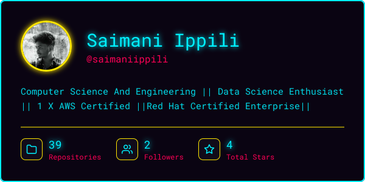
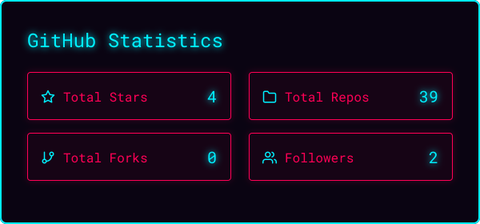
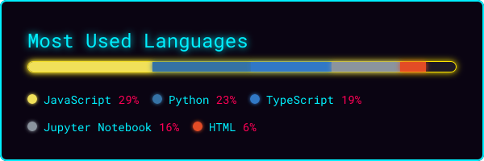
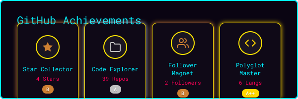

  

 

<table align="center" width="100%">
  <tr>
    <td width="50%" valign="top">
      <h2>🗯️ THE ORIGIN STORY</h2>
      <blockquote><i>"In a world plagued by inefficient code and unoptimized databases, one developer rises to the challenge..."</i></blockquote>
      
I am an undergraduate at <b>KL University</b>, mastering the arcane arts of Data Science, Cloud Computing, and Software Engineering. Armed with a keyboard and a relentless drive, I build solutions that scale and solve real-world problems.

      <ul>
        <li>🧠 <b>Currently Mastering:</b> Advanced Data Science, AI Workflows, and Cloud Architectures.</li>
        <li>⚡ <b>Super Powers:</b> AWS Certified, Red Hat Certified Enterprise.</li>
        <li>🚀 <b>The Mission:</b> Evolve into an unstoppable Data Science & AI Developer.</li>
        <li>💬 <b>Comms Link:</b> Drop an issue or discussion on one of my repos!</li>
      </ul>
    </td>
    <td width="50%" valign="top">
      <h2>🛠️ UTILITY BELT (Tech & Tools)</h2>
      

        
      

      <h2>📈 HERO METRICS (Live Feed)</h2>
      
<i>Tracking system activity in real-time...</i>

      

        
        
        
      

    </td>
  </tr>
</table>

 

  <h2>🎮 CONTRIBUTION GALAXY</h2>
  

 

  <h2>🐍 CONTRIBUTION SNAKE</h2>
  <picture>
    <source media="(prefers-color-scheme: dark)" srcset="https://raw.githubusercontent.com/saimaniippili/saimaniippili/output/github-contribution-grid-snake-dark.svg">
    <source media="(prefers-color-scheme: light)" srcset="https://raw.githubusercontent.com/saimaniippili/saimaniippili/output/github-contribution-grid-snake.svg">
    
  </picture>

 

  <h2>🌟 SUPPORT THE CAUSE</h2>
  
If you find my projects helpful or just love a good origin story, smash that ⭐ button on my repositories!

  

